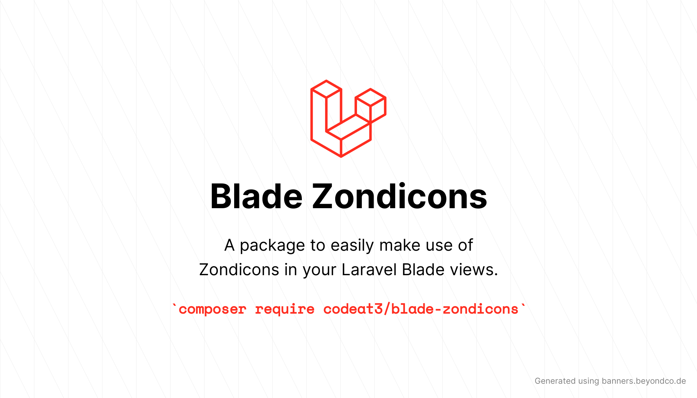

<p align="center">
    
</p>

# Blade Zondicons

<a href="https://github.com/codeat3/blade-zondicons/actions?query=workflow%3ATests">
    
</a>
<a href="https://packagist.org/packages/codeat3/blade-zondicons">
    
</a>
<a href="https://packagist.org/packages/codeat3/blade-zondicons">
    
</a>

This repository was previously maintained under [blade-ui-kit](https://blade-ui-kit.com/) by [Dries Vints](https://github.com/driesvints). We would be maintaining it from now on, under the namespace [codeat3](https://github.com/codeat3).
A package is to easily make use of [Zondicons](http://www.zondicons.com) in your Laravel Blade views.

For a full list of available icons see [the SVG directory](./resources/svg). Zondicons are originally developed by [Steve Schoger](https://twitter.com/steveschoger).

## Requirements

- PHP 7.4 or higher
- Laravel 8.0 or higher

## Installation

```bash
composer require codeat3/blade-zondicons
```

## Updating

Please refer to [`the upgrade guide`](UPGRADE.md) when updating the library.

## Blade Icons

Blade Zondicons uses Blade Icons under the hood. Please refer to [the Blade Icons readme](https://github.com/codeat3/blade-icons) for additional functionality. We also recommend to [enable icon caching](https://github.com/codeat3/blade-icons#caching) with this library.

## Configuration

Blade Zondicons also offers the ability to use features from Blade Icons like default classes, default attributes, etc. If you'd like to configure these, publish the `blade-zondicons.php` config file:

```bash
php artisan vendor:publish --tag=blade-zondicons-config
```

## Usage

Icons can be used as self-closing Blade components which will be compiled to SVG icons:

```blade
<x-zondicon-cloud/>
```

You can also pass classes to your icon components:

```blade
<x-zondicon-cloud class="w-6 h-6 text-gray-500"/>
```

And even use inline styles:

```blade
<x-zondicon-cloud style="color: #555"/>
```

### Raw SVG Icons

If you want to use the raw SVG icons as assets, you can publish them using:

```bash
php artisan vendor:publish --tag=blade-zondicons --force
```

Then use them in your views like:

```blade

```

## Changelog

Check out the [CHANGELOG](CHANGELOG.md) in this repository for all the recent changes.

## Maintainers

Blade Zondicons is developed and maintained by [Dries Vints](https://driesvints.com).

## License

Blade Zondicons is open-sourced software licensed under [the MIT license](LICENSE.md).
